# Steven Guan's Technical Blog Platform

A modern, scalable technical blog platform built with Next.js 14, TypeScript, Tailwind CSS, and Supabase. Features serverless architecture, social authentication, real-time comments, and professional UI/UX.

[](https://github.com/aimlllm/stevenguan-blog)
[](https://vercel.com)
[](https://supabase.com)

## 🏗️ System Architecture

```mermaid
%%{init: {
  'theme': 'base',
  'themeVariables': {
    'primaryColor': '#4F46E5',
    'primaryTextColor': '#000000',
    'primaryBorderColor': '#4338CA',
    'lineColor': '#6366F1',
    'secondaryColor': '#E2E8F0',
    'tertiaryColor': '#F1F5F9',
    'textColor': '#000000',
    'mainBkg': '#ffffff'
  }
}}%%
graph TB
    subgraph "Public Internet"
        User["👤 Web Browser<br/>stevenguan.com"]
        Domain["🌐 Custom Domain<br/>Porkbun DNS"]
    end

    subgraph "Vercel Platform"
        direction TB
        WebApp["🖥️ Next.js 14 App<br/>React Frontend<br/>SSR + SSG"]
        APIRoutes["⚡ API Routes<br/>/api/auth/*<br/>/api/comments<br/>/api/reactions"]
        NextAuth["🔐 NextAuth v5<br/>Session Management<br/>JWT Tokens"]
        
        WebApp --> APIRoutes
        APIRoutes --> NextAuth
    end

    subgraph "OAuth Providers"
        Google["🔵 Google OAuth<br/>Authentication"]
        GitHub["⚫ GitHub OAuth<br/>Authentication"]
    end

    subgraph "Supabase Platform"
        direction TB
        Database["🗄️ PostgreSQL<br/>Users, Comments<br/>Reactions, Analytics"]
        RLS["🛡️ Row Level Security<br/>Access Control"]
        Realtime["⚡ Real-time<br/>Live Updates"]
        
        Database --> RLS
        Database --> Realtime
    end

    subgraph "Content & Development"
        direction TB
        GitHub_Repo["📦 GitHub Repository<br/>aimlllm/stevenguan-blog<br/>Source Code"]
        MDX["📝 MDX Content<br/>Blog Posts<br/>Static Files"]
        
        GitHub_Repo --> MDX
    end

    %% User Flow
    User --> Domain
    Domain --> WebApp
    
    %% Authentication Flow
    WebApp --> NextAuth
    NextAuth --> Google
    NextAuth --> GitHub
    
    %% Database Flow
    APIRoutes --> Database
    Database --> Realtime
    Realtime --> WebApp
    
    %% Development Flow
    GitHub_Repo --> WebApp
    
    %% Styling
    classDef default fill:#F8FAFC,stroke:#475569,stroke-width:2px
    classDef auth fill:#E0E7FF,stroke:#4338CA,stroke-width:2px
    classDef data fill:#F3E8FF,stroke:#6B21A8,stroke-width:2px
    classDef content fill:#DCFCE7,stroke:#166534,stroke-width:2px
    
    class User,Domain,WebApp,APIRoutes default
    class NextAuth,Google,GitHub auth
    class Database,RLS,Realtime data
    class GitHub_Repo,MDX content
```



## 🔄 Authentication & Comment Flow


## 🚀 Deployment & DNS Flow

```mermaid
%%{init: {
  'theme': 'base',
  'themeVariables': {
    'primaryColor': '#4F46E5',
    'primaryTextColor': '#000000',
    'primaryBorderColor': '#4338CA',
    'lineColor': '#6366F1',
    'secondaryColor': '#E2E8F0',
    'tertiaryColor': '#F1F5F9',
    'textColor': '#000000',
    'mainBkg': '#ffffff'
  }
}}%%
graph LR
    subgraph "Development"
        DEV["💻 Local Development<br/>npm run dev<br/>localhost:3000"]
    end

    subgraph "Source Control"
        REPO["📦 GitHub Repository<br/>aimlllm/stevenguan-blog<br/>main branch"]
    end

    subgraph "Build & Deploy"
        VERCEL["⚡ Vercel Platform<br/>Auto Deploy<br/>Environment Variables"]
        BUILD["🔧 Build Process<br/>Next.js Build<br/>Static + Server"]
    end

    subgraph "DNS & Domain"
        PORKBUN["🌐 Porkbun DNS<br/>A Record: 76.76.19.19<br/>CNAME: www → domain"]
        DOMAIN["🔗 stevenguan.com<br/>Custom Domain"]
    end

    subgraph "Production"
        PROD["🌍 Production Site<br/>https://stevenguan.com<br/>Global CDN"]
    end

    DEV --> REPO
    REPO --> VERCEL
    VERCEL --> BUILD
    BUILD --> PROD
    PORKBUN --> DOMAIN
    DOMAIN --> PROD

    classDef dev fill:#E0E7FF,stroke:#4338CA,stroke-width:2px
    classDef deploy fill:#F3E8FF,stroke:#6B21A8,stroke-width:2px
    classDef dns fill:#DCFCE7,stroke:#166534,stroke-width:2px
    classDef prod fill:#FEF3C7,stroke:#92400E,stroke-width:2px
    
    class DEV dev
    class REPO,VERCEL,BUILD deploy
    class PORKBUN,DOMAIN dns
    class PROD prod
```



## 💻 Tech Stack

### **Frontend & Framework**
- **Next.js 14** (App Router) - React framework with SSR/SSG
- **React 18** - UI library with latest features
- **TypeScript** - Type-safe development
- **Tailwind CSS** - Utility-first styling
- **next-themes** - Dark/light mode support

### **Authentication & Security**
- **NextAuth v5** - Authentication framework
- **OAuth Providers** - Google, GitHub social login
- **JWT Tokens** - Secure session management
- **Row Level Security** - Database-level access control

### **Backend & Database**
- **Supabase** - PostgreSQL database with real-time features
- **API Routes** - Serverless functions on Vercel
- **Real-time Subscriptions** - Live comment updates
- **Database Triggers** - Automatic timestamp updates

### **Content & Development**
- **MDX** - Markdown with React components
- **gray-matter** - Frontmatter parsing
- **rehype/remark** - Content processing plugins
- **Docker** - Containerized development environment

### **Deployment & Infrastructure**
- **Vercel** - Serverless hosting and deployment
- **Porkbun** - DNS management
- **GitHub** - Source code repository
- **Environment Variables** - Secure configuration

## 🗄️ Database Schema

### **Users Table**
```sql
CREATE TABLE users (
  id UUID PRIMARY KEY DEFAULT uuid_generate_v4(),
  email TEXT UNIQUE NOT NULL,
  name TEXT,
  image TEXT,
  provider TEXT NOT NULL,
  provider_id TEXT NOT NULL,
  created_at TIMESTAMP WITH TIME ZONE DEFAULT NOW(),
  updated_at TIMESTAMP WITH TIME ZONE DEFAULT NOW()
);
```

### **Comments Table**
```sql
CREATE TABLE comments (
  id UUID PRIMARY KEY DEFAULT uuid_generate_v4(),
  post_slug TEXT NOT NULL,
  user_id UUID REFERENCES users(id) ON DELETE CASCADE,
  content TEXT NOT NULL,
  created_at TIMESTAMP WITH TIME ZONE DEFAULT NOW(),
  updated_at TIMESTAMP WITH TIME ZONE DEFAULT NOW()
);
```

### **Reactions Table**
```sql
CREATE TABLE reactions (
  id UUID PRIMARY KEY DEFAULT uuid_generate_v4(),
  post_slug TEXT NOT NULL,
  user_id UUID REFERENCES users(id) ON DELETE CASCADE,
  type TEXT NOT NULL CHECK (type IN ('like', 'dislike')),
  created_at TIMESTAMP WITH TIME ZONE DEFAULT NOW(),
  UNIQUE(post_slug, user_id)
);
```

### **Analytics Table**
```sql
CREATE TABLE analytics (
  id UUID PRIMARY KEY DEFAULT uuid_generate_v4(),
  post_slug TEXT NOT NULL,
  user_id UUID REFERENCES users(id) ON DELETE SET NULL,
  event_type TEXT NOT NULL,
  created_at TIMESTAMP WITH TIME ZONE DEFAULT NOW()
);
```

## 🔧 Vercel ↔ Supabase API Interface

### **Authentication API**
```typescript
// /api/auth/[...nextauth]/route.ts
// NextAuth handles OAuth and creates sessions
// Sessions include user ID from Supabase users table

// Connection: NextAuth → Supabase via syncUserToSupabase()
const { data } = await supabaseAdmin
  .from('users')
  .insert({ email, name, provider, provider_id });
```

### **Comments API**
```typescript
// /api/comments/route.ts
// POST: Create new comment with authentication
// GET: Fetch comments for a post

// Connection: Vercel API → Supabase with RLS
const { data } = await supabaseAdmin
  .from('comments')
  .insert({ post_slug, user_id, content })
  .select('*, user:users(name, image)');
```

### **Reactions API**
```typescript
// /api/reactions/route.ts
// POST: Toggle like/dislike reaction
// GET: Get reaction counts for posts

// Connection: Upsert pattern with unique constraint
const { data } = await supabaseAdmin
  .from('reactions')
  .upsert({ post_slug, user_id, type })
  .onConflict('post_slug,user_id');
```

### **Real-time Connection**
```typescript
// Client-side real-time subscriptions
supabase
  .channel('comments')
  .on('postgres_changes', {
    event: 'INSERT',
    schema: 'public',
    table: 'comments'
  }, (payload) => {
    // Auto-update UI when new comments arrive
  })
  .subscribe();
```

## ⚙️ Environment Variables

```bash
# Next.js Configuration
NEXTAUTH_URL=https://stevenguan.com
NEXTAUTH_SECRET=your-generated-secret

# Social Authentication
GOOGLE_CLIENT_ID=928585084803-8purk82meipnp8k9k3sbfdd3ctc66du1.apps.googleusercontent.com
GOOGLE_CLIENT_SECRET=your-google-client-secret
GITHUB_CLIENT_ID=Iv23liM1F88FmJSn3G9a
GITHUB_CLIENT_SECRET=0b671dd5e8a2e246877129d4bb213eed84c7a1ed

# Supabase Database
NEXT_PUBLIC_SUPABASE_URL=https://asciyoncfkeqkkcxdrqz.supabase.co
NEXT_PUBLIC_SUPABASE_ANON_KEY=your-anon-key
SUPABASE_SERVICE_ROLE_KEY=your-service-role-key

# Site Configuration
SITE_URL=https://stevenguan.com
SITE_NAME=Steven Guan's log
AUTHOR_NAME=Steven
AUTHOR_EMAIL=steven@stevenguan.com
```

## 🚀 Quick Start

### **1. Clone Repository**
```bash
git clone https://github.com/aimlllm/stevenguan-blog.git
cd stevenguan-blog
npm install
```

### **2. Environment Setup**
```bash
cp env.example .env.local
# Edit .env.local with your configuration
```

### **3. Development**
```bash
# Docker (Recommended)
docker-compose up --build

# Traditional
npm run dev
```

### **4. Production Deployment**
See the detailed [SETUP-GUIDE.md](./SETUP-GUIDE.md) for complete Vercel deployment instructions.

## 📝 Writing Blog Posts

Create MDX files in `content/posts/`:

```markdown
---
title: "Understanding Large Language Models"
slug: "understanding-llms"
description: "Deep dive into LLM architecture and applications"
publishedAt: "2024-12-15"
tags: ["AI", "LLM", "Machine Learning"]
categories: ["Technical", "AI"]
author: "Steven"
featured: true
draft: false
---

# Your content here

Write your blog post in **Markdown** with React components support.
```

## 🛡️ Security Features

- **Row Level Security (RLS)** - Database-level access control
- **JWT Session Management** - Secure authentication tokens
- **OAuth Integration** - Trusted social login providers
- **Environment Variables** - Secure configuration management
- **API Rate Limiting** - Built-in Vercel protection

## 📊 Features

### ✅ **Implemented**
- 📝 MDX blog posts with syntax highlighting
- 🌗 Dark/light mode toggle
- 🔐 Social authentication (Google, GitHub)
- 💬 Real-time comment system
- 👍 Post reactions (like/dislike)
- 📱 Mobile responsive design
- 🔍 Search and filtering
- 🏷️ Tags and categories
- 📊 Analytics tracking
- 🐳 Docker development environment

### 🚧 **Extensible**
- 📧 Email notifications
- 🔗 LinkedIn/Facebook OAuth
- 📊 Advanced analytics dashboard
- 📧 Newsletter signup
- 🎨 Rich text editor
- 🔍 Full-text search

## 📞 Support

- **Repository**: [GitHub Issues](https://github.com/aimlllm/stevenguan-blog/issues)
- **Documentation**: [Setup Guide](./SETUP-GUIDE.md)
- **Live Site**: [stevenguan.com](https://stevenguan.com)

---

**Built with ❤️ by Steven Guan** | **Powered by Vercel + Supabase** 